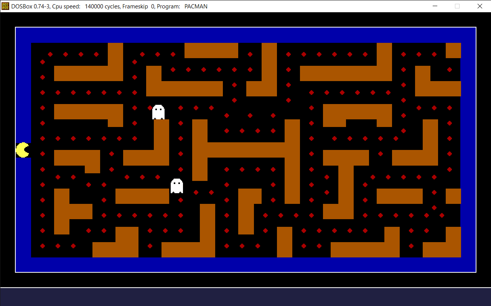
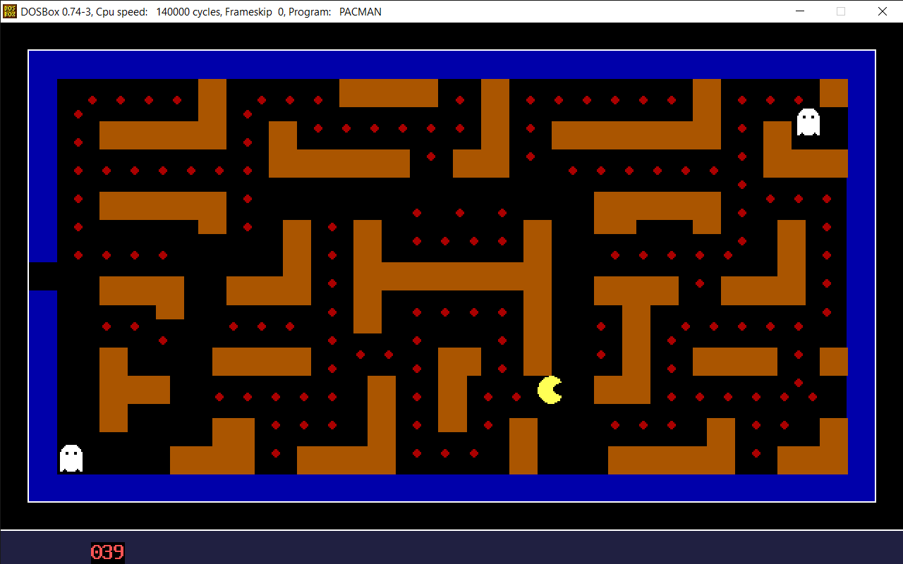

# Demo




# Usage

1. Open [DOSBox](./Tools/Dosbox/DOSBox.exe)
2. Mount the game directory (assume game in D:\Pacman)
    ```cmd
    mount d D:\Pacman
    ```
3. Open mounted directory
    ```cmd
    d:
    ```
4. Compile the game
    ```cmd
    .\Tools\Tasm\TASM.exe pacman.asm
    ```
5. Link the game
    ```cmd
    .\Tools\Tasm\TLINK.exe PACMAN.OBJ
    ```
6. Run the game
    ```cmd
    pacman.exe
    ```

# To Make It Faster and Larger

1. Open Run (Win + R)
2. Paste and Enter `C:\Users\%username%\AppData\Local\DOSBox`
3. Edit [dosbox-0.74-3.conf] 
   1. under "[sdl]" > update "windowresolution" (for example `windowresolution=1600x800`)
   2. under "[sdl]" > update "output" (for example `output=ddraw`)
   3. under "[CPU]" > increase "cycles" (for example `cycles=140000`)

